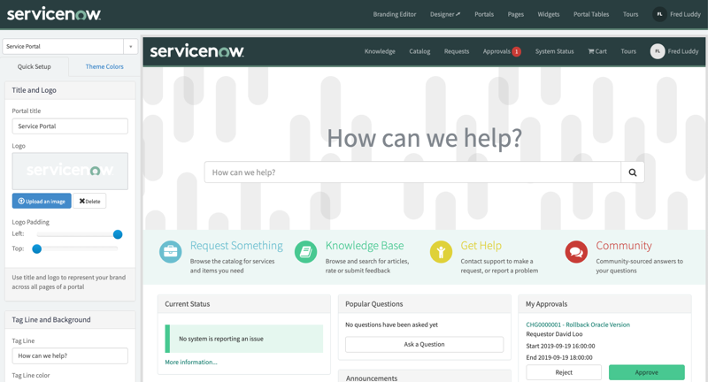
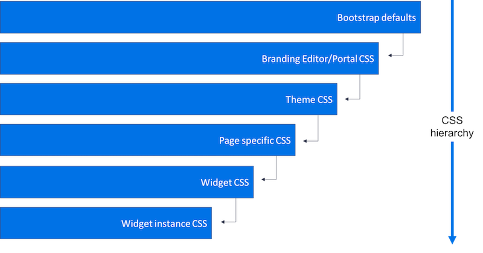

## Introduction
Most requestor experiences on ServiceNow are built on top of the Service Portal framework. This framework brings together AngularJS and Bootstrap to provide an extensible, responsive user experience. Many customers of ServiceNow choose to theme their experience to match their company's brand. This guide will walk you through your theming options from the simple to complex.

## How to approach theming
If your company has established branding guidelines for web applications, there usually is a team that owns that specification. Try to partner with them to adapt the guidelines to the options the platform allows you to manipulate.

Absent branding guidelines, you may be able to reference your company's public web site or other well regarded applications and inspect the style used there.

There a few things to focus on to effectively apply your brand

- **Primary and secondary colors** - these are often used for calls to action, buttons and navigation items throughout your reference site. 
- **Spacing** - does your reference site have an airy, spaced-out design or a condensed, focused layout? This may affect how you apply marg
- **Fonts** - By default, the Employee Center portal uses the Lato font, and the stock Service Portal demo uses Source San Pro. You may choose to override this with your brand's font.

Depending on the complexity of the changes you want to make, your familiarity with CSS and SASS, and your plans to scale your use of ServiceNow, there are multiple paths to take when it comes to theming
 
## Branding Editor
The simplest way to theme a portal is via the Branding Editor; which provides a real time preview of the impacts of your changes. You do not need any knowledge of CSS or SASS.

Depending on the portal you select, a limited set of color overrides are provided. Changing these variables will only apply to the specific portal selected in the interface.

Changes made in Branding Editor appear in the "CSS variables" field on portal record in `sp_portal`.

## Variable Overrides
The Service Portal framework uses the [Bootstrap (v3.3.6)](https://getbootstrap.com/docs/3.4/) frontend toolkit as the foundational stylesheet. If you understand the basics of [SASS variables](https://sass-lang.com/documentation/variables), you can easily override the out of the box themes.

The platform exposes the [SASS variables](https://getbootstrap.com/docs/3.4/css/#sass) as if you were building you are bootstrap CSS file from source. That means you can set variables overrides in the portal record. To get to the portal record.

1. Open the Application Navigator
2. Search for `Portals`
3. Click on the **Portals** menu item underneath **Service Portal**
4. Open the record that correspond to the portal you are working on
5. Create or modify the variables in the **CSS Variables** field

[Variable Reference](https://getbootstrap.com/docs/3.4/customize/#less-variables-section) - This uses the LESS prefix of an `@` symbol while SASS expects a `$`

## Theme Records
Creating a theme record and then applying it to the portal is the recommended approach for creating scaleable branding across your instance. One theme record can be applied to multiple portals, giving you a central place to make changes once and impact many experiences.

Docs: [Create a Portal Theme](https://docs.servicenow.com/csh?topicname=c_CustomCSS.html&version=latest)

In the theme record you can set the SASS variables or use the CSS Includes related list to write your own CSS for the elements within the portal.

For example, in a CSS include you can create a CSS selector that overrides the style for `.text-muted` with any properties you want, you are not just limited to Bootstrap's variables.

[Bootstrap CSS Helper Class Reference](https://www.w3schools.com/bootstrap/bootstrap_ref_css_helpers.asp)

## More Specific Options
The framework allows you to override styles at the page level, in a widget definition or an instance of a widget.

  

For a full breakdown of styling options reference the Docs article [Service Portal styles](https://docs.servicenow.com/csh?topicname=portal-css.html&version=latest)

## Fonts in Service Portal
There is no one-size fits all guidance for overriding a portal's default fonts. A lot depends on your IT infrastructure security and ability to access hosted fonts.

A few options that are out there

1. Use a CSS Include with the Source set to `URL` and paste in the link to the hosted font.
2. Encode the font as Base64 and paste it directly into a CSS Include
3. Attach the font files to a CSS include record and reference via `sys_attachment.do?<SYS_ID>`

Work with your platform owner and admin team to figure out what works for your environment.